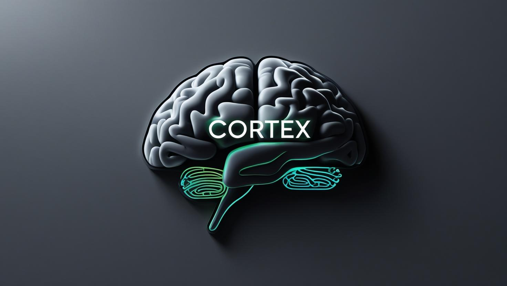

<p align="center"><strong>❤️ <em>Build. Ship. Scale.</em> ❤️</strong></p>
<h2 align="center">CORTEX</h2>


<p align="center"><strong>A composable orchestration framework for agents, tools, and LLMs</strong></p>

---

> ⚙️ **Tool orchestration meets multi-agent AI.**  
> 🧩 Modular. 🚀 Scalable. 🧠 Agentic.

---

## 🔥 What is CORTEX?

**CORTEX** (Composable Orchestration Runtime for Tools/Agent EXchange - in LLM Applications) is an open-source framework to build:

- LLM-powered agents
- Tool servers with schema-based execution
- Agent-to-agent protocols
- Function-spec driven workflows (OpenAI, LangChain, Semantic Kernel, etc.)

---

## 📦 Core Modules

| Module      | Description                                                              | Status     |
|-------------|---------------------------------------------------------------------------|------------|
| [`YAMCP`](./yamcp/README.md) | Multi-transport plugin-based tool server  <br/>                       | ✅ In testing / v0.1 |
| `A2A`       | Agent-to-agent messaging protocol (queue & memory based)                  | 🚧 Coming Soon |
| `Schema`    | Unified OpenAPI / Function Spec builder for LLM tool compatibility        | 🧪 Drafting |
| `Planner`   | LLM-based router that can plan multi-step calls to tools and agents       | 📌 Roadmap |


* YAMCP 
>>✅ For full documentation of the YAMCP tool server framework, see   ➡️ **[YAMCP_README](./yamcp/README.md)**  

---

## 💡 Why CORTEX?

- **LLM-native** architecture: schema-aware, tool-compatible, async-friendly
- **Composable**: Plug-and-play modules (tools, agents, queues, planners)
- **Open to extension**: Drop in new skills or agents with minimal boilerplate

---

## 🛠 Getting Started

```bash
# Clone the project
git clone https://github.com/yourname/cortex.git
cd cortex

# Go to a module (e.g., yamcp)
cd yamcp
python3 -m logics.main

```

## 🧩 Coming Soon


| **Feature**       | **Description**                                                                 |
|-------------------|---------------------------------------------------------------------------------|
| Agent routing      | Use LLMs to route user intent to correct tools/agents                          |
| A2A protocol       | Let agents communicate, delegate, sync with memory queues                      |
| Agent memory       | Token-level, document-level, or event memory models                            |
| Schema UI          | Auto-gen OpenAI / LangChain tool schemas with docs                             |


## 👥 Contributing

We’re actively shaping the foundation of AI-native orchestration.
We welcome:

🚀 New modules or adapters (like A2A, queue runners)

🛠 New tools via YAMCP plugin system

📢 Feature ideas, bug reports, and LLM orchestration proposals

Open a GitHub issue or start a discussion.

## Contact

Created by : Biswajit Tripathy

[](https://github.com/yourusername/yourrepo)

https://github.com/BiswajitBiswa 

[](mailto:your.email@gmail.com)

biswajittripathy1999bt@gmail.com


<h1 align="center"><strong>*** <em>Join the AI Orchestration revolution.</em>*** </strong></h1>
