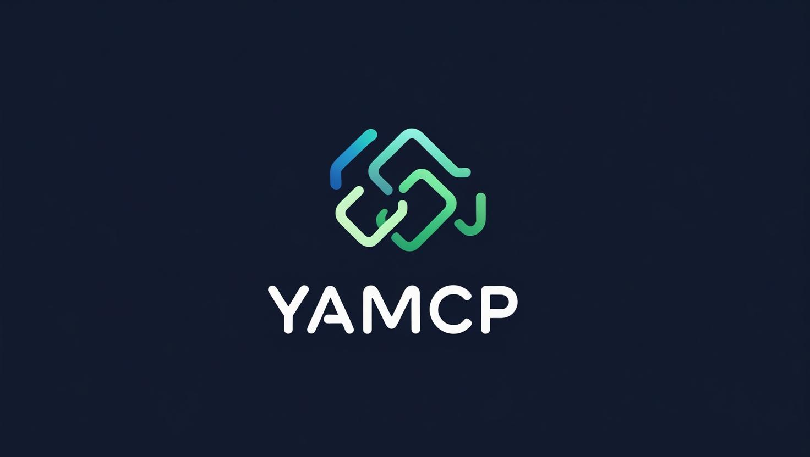
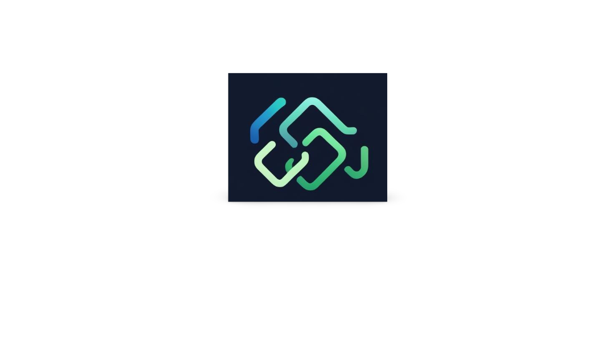

<h1 align="center">YAMCP — Yet Another Model Context Protocol</h1>




---

**🚀 Drive your AI to scale. Ship smarter. Build faster.**

YAMCP is a lightweight, extensible framework to build, run, and orchestrate **multi-modal AI agents and microservice control plane (MCP) servers**.

Whether you want to craft powerful LLM agents that interact with external APIs or rapidly deploy scalable HTTP/WS/CLI servers for your AI tools — YAMCP is your launchpad.

---

## 🔍 What is YAMCP?

### 1. MCP Server as a Tool-Serving Backend for LLM Agents

Modern large language models (GPT-4, Claude, etc.) excel at understanding and generating language but lack direct access to APIs or business logic. 

The trend? Wrap external capabilities as **tools or skills**, and let LLM agents plan how to invoke them.

YAMCP acts as a **tool server**:

- Wrapping external APIs, business logic, and custom apps as tools or skills
- Abstracts tool registration and dynamic plugin discovery.
- Supports multiple transports — HTTP, WebSocket, CLI.
- Enables LLMs or orchestrators to call these tools seamlessly and extend their capabilities.

### 2. Trending LLM Agent Patterns

- **Agent + Tool Paradigm:**  
  LLM agents parse user queries, decide which tools to call, call MCP server APIs, and aggregate results. Examples: LangChain, Microsoft Semantic Kernel, OpenAI Functions.

- **OpenAI Functions & Plugins:**  
  YAMCP can serve as an OpenAI Plugin backend, exposing OpenAPI or GPT function specs for tools to enable auto-discovery and invocation.

### 3. Why YAMCP's Architecture Fits Perfectly

- **Plugin-based extensibility:** Add new domain skills by dropping plugin folders — no core rewrites.
- **Transport flexibility:** HTTP, WebSocket, CLI interfaces to suit diverse clients — browsers, bots, terminals.
- **Dynamic tool registration:** CoreApp + decorators + class-based tools build a real-time tool catalog.
- **FastAPI + Pydantic:** Solid request validation and OpenAPI generation for smooth integration with LLMs.

### 4. How Will LLMs Use YAMCP in Practice

Imagine this conversation between a user and an LLM integrated with your MCP server:


User: 
>Play my ‘Road Trip’ playlist on Spotify.

LLM agent workflow:

>Parses the user's intent and identifies relevant tools:

*  list_playlists 
* play_song

Invokes MCP server endpoints sequentially:


>/api/http/run/list_playlists → gets playlists
> 
> /api/http/run/play_song → starts playback

Responds with natural language reply.


### 5. Bridging YAMCP with LLM Frameworks

- Auto-generate OpenAPI or GPT function schemas per tool.
- Provide contextual hints or prompt templates for agents.
- Wrap YAMCP endpoints as LangChain or Semantic Kernel tools.
- Support OpenAI Function Calls for native-like LLM integrations.

---

## ⚡ Scaling AI with YAMCP

YAMCP empowers production-grade AI by:

- **Decoupling logic:** Tools are modular and independently deployable.
- **Synchronous or asynchronous flows support.**
- **Multi-transport:** Serve APIs efficiently to diverse clients.
- **Dynamic extensibility:** Easily add or update capabilities without downtime.
- **Validated schemas:** Ensure robust, error-resistant input/output for tooling.
- **Lightweight & performant:** Minimal overhead for fast startup and scaling.

---


## 💡 Integration with LangChain &  Other Agent Frameworks

YAMCP provides a powerful backend to LangChain, OpenAI function calls, Microsoft Semantic Kernel, and other agent frameworks by:


* Exposing tools as HTTP/WS endpoints callable from agents

* Allowing generation of OpenAPI or function schemas for automatic tool discovery

* Providing a plugin ecosystem to rapidly add capabilities

* Letting users build custom LLM agents that plan and execute via YAMCP tools

---

## 🔥 Context with Related Frameworks

| Feature                 | YAMCP                     | LangChain                    | FastMCP           |
|-------------------------|---------------------------|------------------------------|-------------------|
| Multi-transport modes    | HTTP / WS / CLI / Embedded| Mostly internal to LangChain | HTTP / WS         |
| Dynamic plugin tooling   | Yes                       | Limited dynamic plugin loading| Basic plugin system|
| Tight LLM-tool orchestration | Built-in, schema-aware  | Agent wrappers needed        | Minimal           |
| Lightweight & performant | Minimal dependencies, fast| Heavier, many dependencies   | Moderate          |
| OpenAPI / Function Spec | Planned / extendable       | Available                    | Limited           |

---

## 🎯 Quick Start

### Install

```bash
git clone https://github.com/yourusername/yamcp.git
cd yamcp
pip install -r requirements.txt
```
Configure via Environment Variables

Create a .env file or Set Following Environment Variables :
```bash
YAMCP_MODE=http_ws
YAMCP_PLUGINS=https://example.com/plugins/simple_tool.py,./local_plugins/router_plugin.py
YAMCP_HOST=0.0.0.0
YAMCP_PORT=9001
```
Currently Supported YAMCP Modes:
```bash
YAMCP_MODE=cli|http|ws|http_ws
```

Run Combined HTTP + WebSocket MCP Server

```bash
export YAMCP_MODE=http_ws
python -m yamcp.main
```

Run CLI Mode (Local Console Agent | Testing Your Tools In Isolation)
```bash
export YAMCP_MODE=cli
python -m yamcp.main --mode cli --plugins plugins/
```

Run Embedded (programmatic use)

```bash
from yamcp.core.app import CoreApp
from yamcp.plugins.loader import register_plugins
from yamcp.transport.embed import EmbedServer

core_app = CoreApp()
register_plugins(core_app, ["plugins/"])

runner = EmbedServer(core_app)
runner.run()
```


## ⚡ EXAMPLES

1. plugins/examples/simple_tool.py
```bash
from yamcp.core.decorators import tool


@tool("say_hello")
def say_hello(name: str):
    return f"Hello, {name}!"

```

2. plugins/examples/class_tool.py
```bash
from yamcp.core.decorators import ToolBase


class ReverseText(ToolBase):
    name = "reverse_text"
    description = "Reverses a string"
    author = "dev"

    async def run(self, text: str):
        return text[::-1]

    @classmethod
    def register(cls, core_app, app=None):
        core_app.register_tool(cls.name, cls())


```


3. plugins/examples/router_plugin.py
```bash
from fastapi import APIRouter

router = APIRouter()


@router.get("/hello")
async def hello():
    return {"msg": "Hello from router plugin"}


def run_tool_example(name: str) -> str:
    return f"Hello {name} from router plugin!"


def register(core_app, app=None):
    core_app.register_tool("greet", run_tool_example)
    if app:
        app.include_router(router, prefix="/plugin")


```

4. examples/minimal_agent.py

#### This script acts as a minimal example "agent" client calling your MCP server tools.
```bash
import asyncio
import httpx

API_BASE = "http://localhost:8080/api/http/run"


async def call_tool(tool_name: str, params: dict):
    url = f"{API_BASE}/{tool_name}"
    async with httpx.AsyncClient() as client:
        response = await client.post(url, json=params)
        response.raise_for_status()
        data = response.json()
        if data.get("status") == "ok":
            return data["result"]
        else:
            raise Exception(f"Tool error: {data}")


async def main():
    # Call say_hello tool
    greeting = await call_tool("say_hello", {"name": "Alice"})
    print("say_hello result:", greeting)

    # Call reverse_text tool (async class-based tool)
    reversed_str = await call_tool("reverse_text", {"text": "YAMCP"})
    print("reverse_text result:", reversed_str)

    # Call greet (router plugin tool)
    greet_result = await call_tool("greet", {"name": "Bob"})
    print("greet result:", greet_result)


if __name__ == "__main__":
    asyncio.run(main())


```


## 🛠️  How to Use These Examples

1. Place the plugins inside your plugins/examples directory.

2. Run your MCP server with plugins folder configured, e.g.:
```bash
export YAMCP_PLUGINS_PATH=plugins/examples
RUN python -m yamcp.main
```


## 🚀 Roadmap
> Requirements Below Yet To Be Researched
* Tools Chaining
* Scheduling / Offloading 
* More first-party plugin examples (Spotify, Twitter, Calendar, IoT)

* LangChain & Semantic Kernel integration adapters
* Interoperability
* Distributed multi-agent orchestration

* GUI dashboard for managing tools & servers

* Expanded transport protocols (gRPC, MQTT, etc.)

##  🤝 Contribute & Credits

YAMCP is open source under the Creative Commons Attribution 4.0 International License (CC BY 4.0).

Feel free to fork, improve, and extend — please give credit to the original authors!


## Contact

Created by : Biswajit Tripathy

[](https://github.com/yourusername/yourrepo)

https://github.com/BiswajitBiswa 

[](mailto:your.email@gmail.com)

biswajittripathy1999bt@gmail.com


<h1 align="center"><strong>*** <em>Join the AI orchestration revolution.</em>*** </strong></h1>

<h1 align="center"><strong>YAMCP — Yet Another Model Context Protocol</strong></h1>

<p align="center"><em>Build. Ship. Scale.</em></p>


<p align="center">
  
</p>


## 🔗 See Also
👉 Main project: ➡️ **[CORTEX README](./yamcp/README.md)**  

🧪 Planned modules: A2A messaging, OpenAI-compatible schemas, async planner